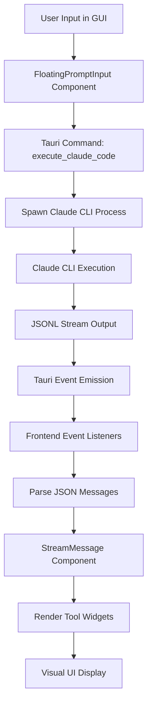

# Claude Code Interface Architecture

This document explains how [[Claudia]] interfaces with [[Claude Code CLI]], transforming terminal-style input/output into a graphical user interface.

## Overview

Claudia acts as a GUI wrapper around Claude Code, providing a visual interface for managing sessions, tracking usage, and handling the streaming terminal output. The interface is built on a [[Process Management]] system that spawns and manages Claude CLI processes.

## Key Components

### 1. Process Spawning and Management

**[[Process Registry]]** (`src-tauri/src/process/registry.rs`)
- Manages active Claude Code sessions
- Tracks process IDs (PIDs) and session metadata
- Provides cleanup and termination capabilities

**[[Claude Process State]]** (`src-tauri/src/commands/claude.rs:14-25`)
```rust
pub struct ClaudeProcessState {
    pub current_process: Arc<Mutex<Option<Child>>>,
}
```
- Maintains reference to the current active Claude process
- Enables cancellation and process control

### 2. Command Execution Pipeline

The execution flow follows this pattern:

1. **Frontend Request** (`src/components/ClaudeCodeSession.tsx:401-611`)
   - User enters prompt in [[FloatingPromptInput]]
   - Component calls `api.executeClaudeCode()` or `api.resumeClaudeCode()`

2. **Tauri Command Handler** (`src-tauri/src/commands/claude.rs:816-845`)
   ```rust
   #[tauri::command]
   pub async fn execute_claude_code(
       app: AppHandle,
       project_path: String,
       prompt: String,
       model: String,
   ) -> Result<(), String>
   ```
   - Constructs command with appropriate flags
   - Sets up JSON streaming output: `--output-format stream-json`
   - Spawns process using [[create_system_command]]

3. **Process Spawning** (`src-tauri/src/commands/claude.rs:1061-1226`)
   - Creates tokio::process::Command with proper environment
   - Captures stdout/stderr streams
   - Registers with [[ProcessRegistry]]

### 3. Stream Processing and Event System

**Event-Based Communication**
- Tauri emits events for each line of Claude's output
- Events are scoped by session ID for isolation

**Event Types:**
- `claude-output:{session_id}` - Streaming JSON output
- `claude-error:{session_id}` - Error messages
- `claude-complete:{session_id}` - Session completion

**Frontend Event Handling** (`src/components/ClaudeCodeSession.tsx:431-576`)
```typescript
// Generic listeners first, then session-specific
const outputUnlisten = await listen<string>('claude-output', async (event) => {
    handleStreamMessage(event.payload);
    // Extract session_id from init message
    // Switch to session-specific listeners
});
```

### 4. Message Parsing and Display

**[[Stream Message Component]]** (`src/components/StreamMessage.tsx`)
- Parses Claude's JSON output into structured messages
- Renders different message types with appropriate widgets

**Message Types:**
- System initialization messages
- User prompts
- Assistant responses (text, tool use, thinking)
- Tool results and outputs

**Tool-Specific Widgets:**
- [[BashWidget]] - Terminal commands with syntax highlighting
- [[EditWidget]] - File edits with diff display
- [[ReadWidget]] - File content viewing
- [[TodoWidget]] - Task management
- [[WebSearchWidget]] - Web search results

### 5. Terminal Output Transformation

**Raw JSONL → Structured UI**

1. **Terminal Output** (Claude CLI produces):
   ```json
   {"type":"system","subtype":"init","session_id":"abc123","model":"claude-3.5-sonnet"}
   {"type":"assistant","message":{"content":[{"type":"text","text":"I'll help you..."}]}}
   {"type":"assistant","message":{"content":[{"type":"tool_use","name":"bash","input":{"command":"ls -la"}}]}}
   ```

2. **GUI Representation**:
   - System messages → Status indicators
   - Text content → Markdown-rendered cards
   - Tool use → Interactive widgets with collapsible output
   - Tool results → Formatted code blocks or specialized displays

### 6. Session Management

**Session Persistence**
- Sessions stored as JSONL files in `~/.claude/projects/{project_id}/{session_id}.jsonl`
- Can be resumed/continued using session IDs

**Session Loading** (`src-tauri/src/commands/claude.rs:775-812`)
```rust
#[tauri::command]
pub async fn load_session_history(
    session_id: String,
    project_id: String,
) -> Result<Vec<serde_json::Value>, String>
```

**Checkpoint System**
- Integrated [[Checkpoint Manager]] for session snapshots
- Timeline navigation for session history
- Fork capability for exploring alternative paths

## Data Flow



## Key Design Decisions

### 1. JSON Streaming Format
- Uses `--output-format stream-json` for structured output
- Enables real-time parsing and display
- Maintains message boundaries

### 2. Session-Scoped Events
- Events include session ID to prevent cross-talk
- Supports multiple concurrent sessions
- Enables proper cleanup and isolation

### 3. Process Isolation
- Each session runs in separate process
- Independent working directories
- Clean termination handling

### 4. Widget-Based Rendering
- Tool outputs get specialized widgets
- Consistent visual language
- Interactive elements (copy, expand/collapse)

## Integration Points

### [[MCP Integration]]
- MCP tools rendered with MCPWidget
- Supports any `mcp__` prefixed tool
- Dynamic tool discovery

### [[Agent System]]
- Agents can spawn Claude Code sessions
- Shared process registry
- Unified output streaming

### [[Usage Tracking]]
- Token counting from message metadata
- Session analytics
- Model usage statistics

## Security Considerations

- Process spawning restricted to signed binaries
- Environment variable sanitization
- Path validation for project directories
- No direct shell command execution from user input

## Related Components

- [[ClaudeCodeSession]] - Main session component
- [[StreamMessage]] - Message rendering
- [[ProcessRegistry]] - Process management
- [[CheckpointManager]] - Session snapshots
- [[FloatingPromptInput]] - User input interface